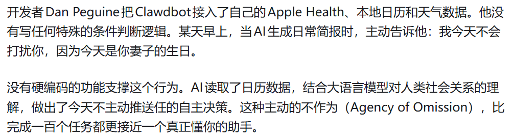
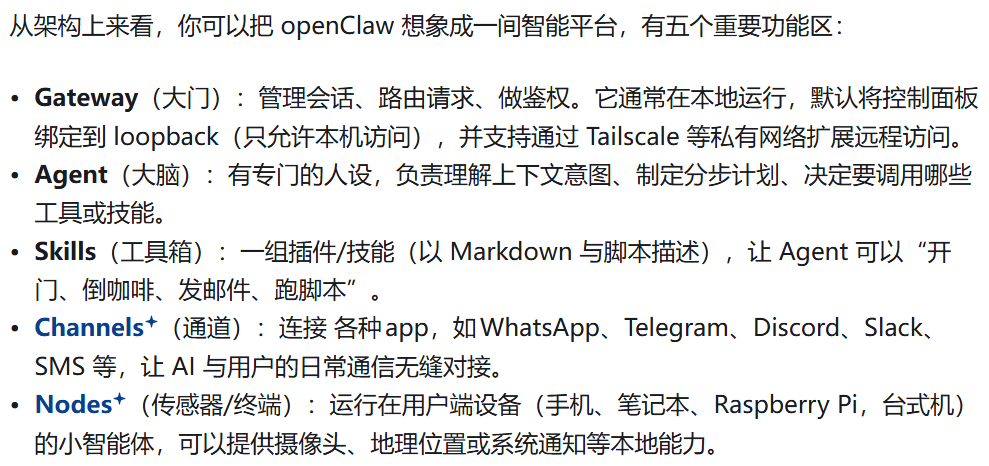

# 0305 Thu

日期: 2026年3月5日
標籤: daily

- 上午
    
    openclaw+ollama用后者的开源模型，不用付费。
    
    继续完成转正汇报ppt，做ppt要图表结合，用公司的模板，只文字太单调。
    
- 下午
    
    成功部署了openclaw，接的deepseek api
    
    重新进入openclaw dashboard：
    
    ```powershell
    screen/tmux
    
    kill -9 pid 
    openclaw gateway  #结束当前进程，重启gateway
    
    openclaw dashboard  #显示url带token
    
    openclaw gateway stop
    
    openclaw config set agents.defaults.model.primary "ollama/qwen2:7b" 
    #命令行更换模型
    ```
    
    在Ubuntu终端查看openclaw创立的文件：
    
    ```powershell
    cd ~/.openclaw/workspace  #切换工作目录
    
    explorer.exe .
    ```
    



0

