# 0317 Tue

日期: 2026年3月17日
標籤: daily

- 上午
    1. 正大食品信息提取程序收尾
    2. 多式联运与汽运领域数字化技术交流旁听（逗号科技

- 下午
1. 正大食品信息提取程序debug。接口调用识别到的简称（轴心、小蹄）跟单证通（猪心、小肠）里识别的不同。是识别规则的问题，已解决。已发给运作同事。

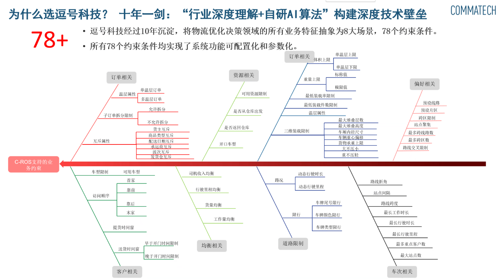

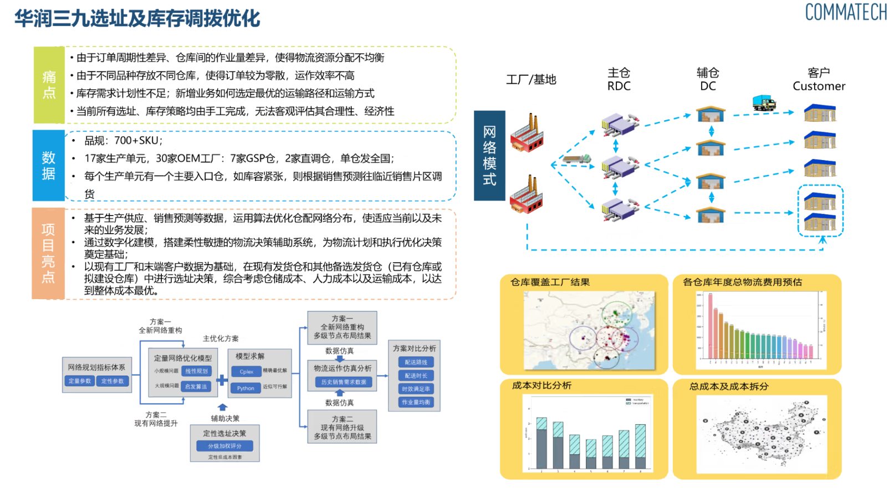

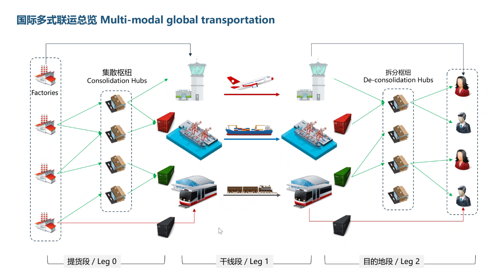

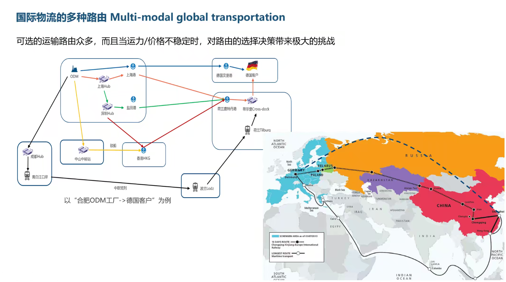

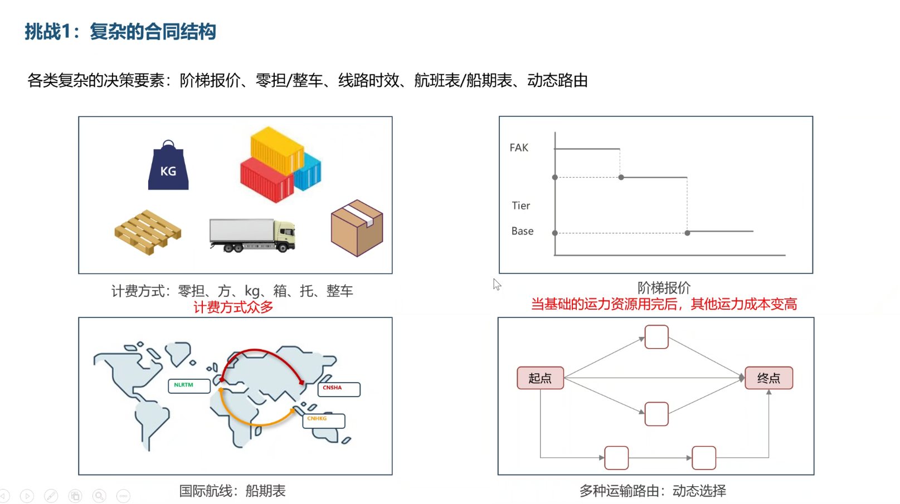

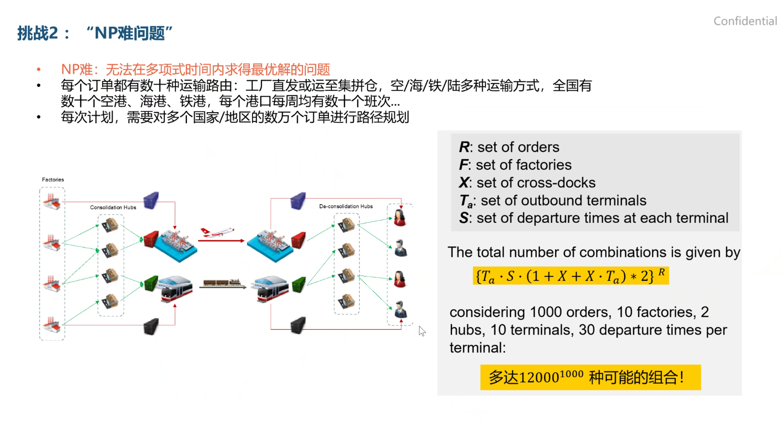

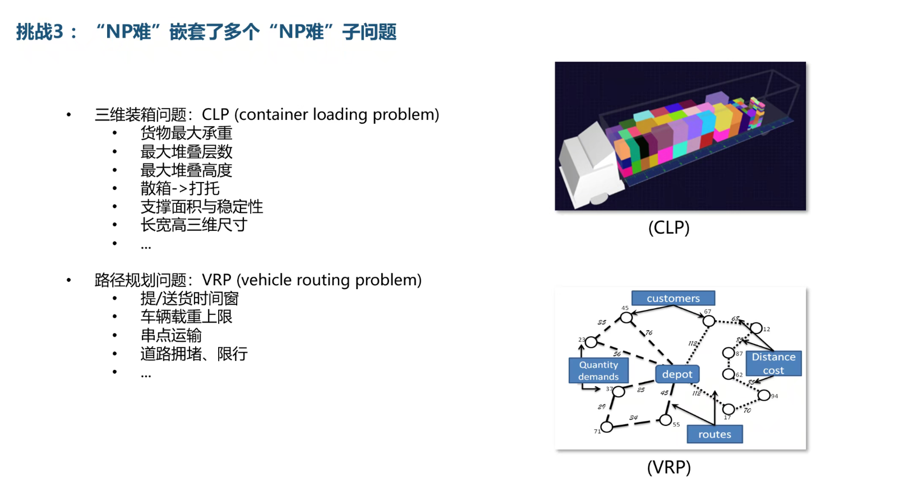

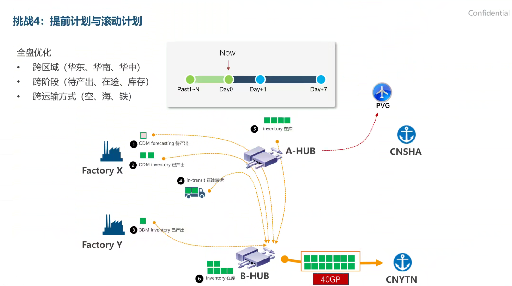

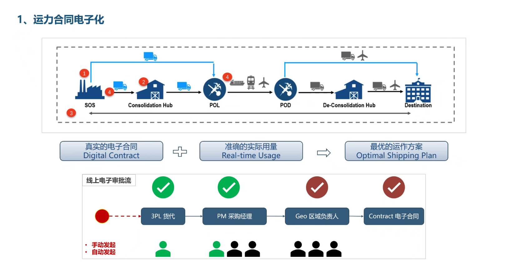

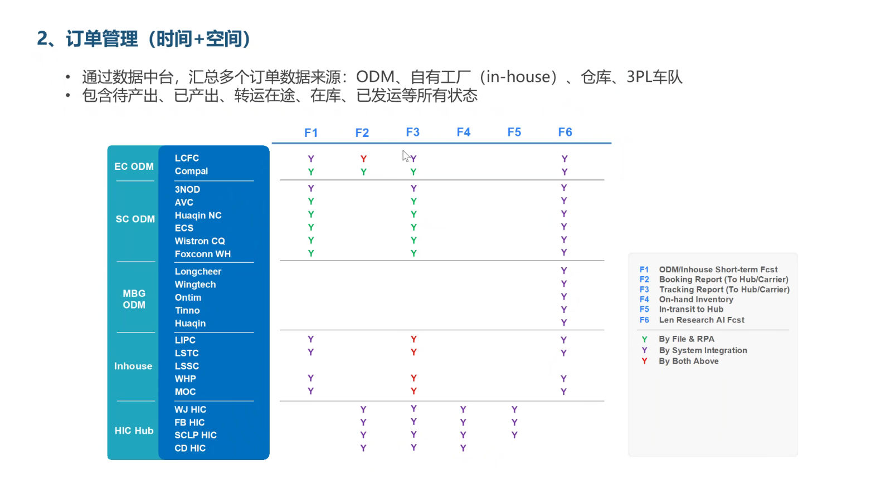

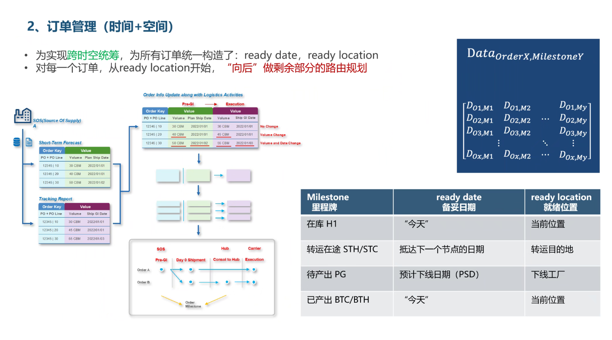

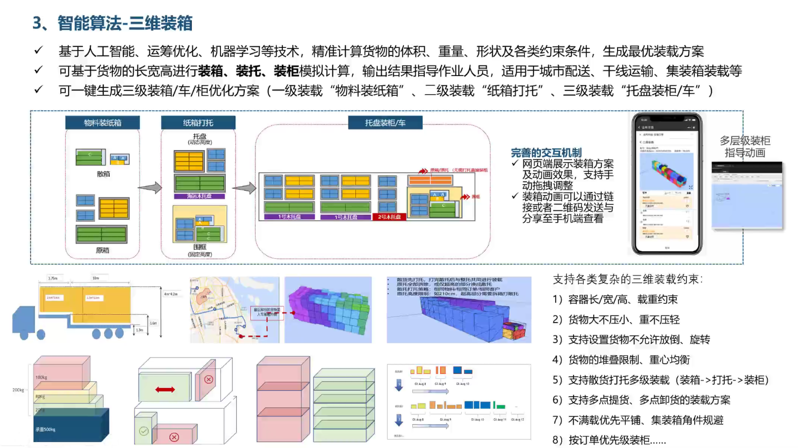

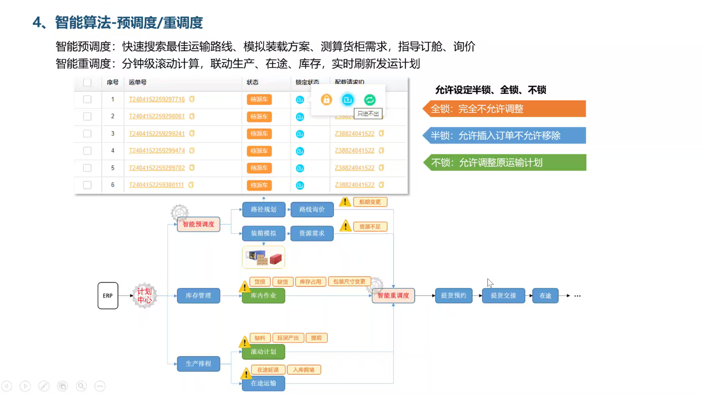

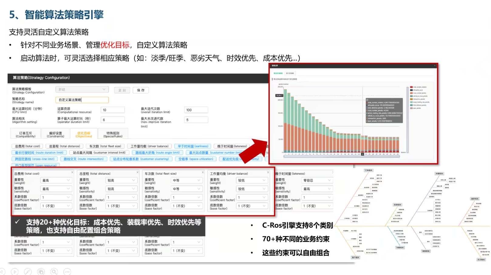

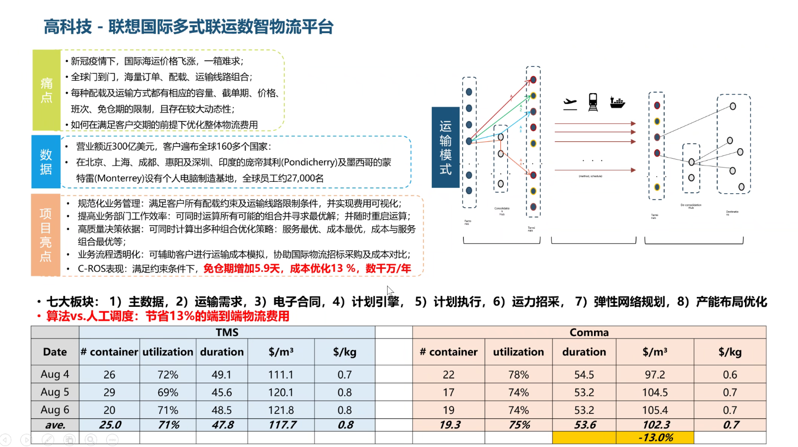