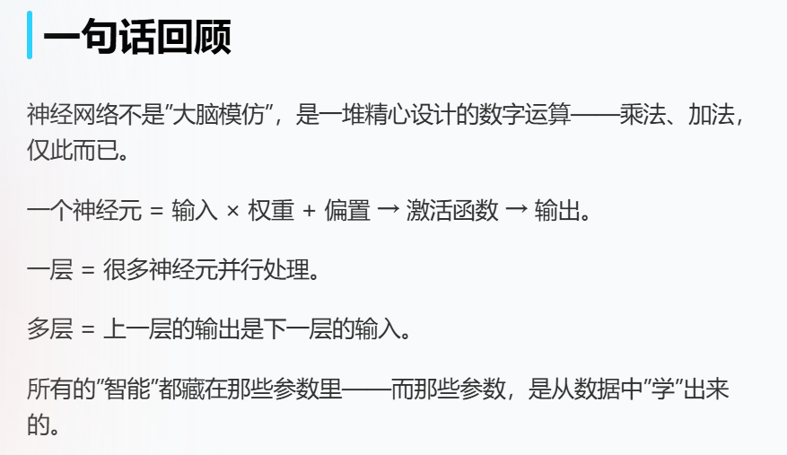
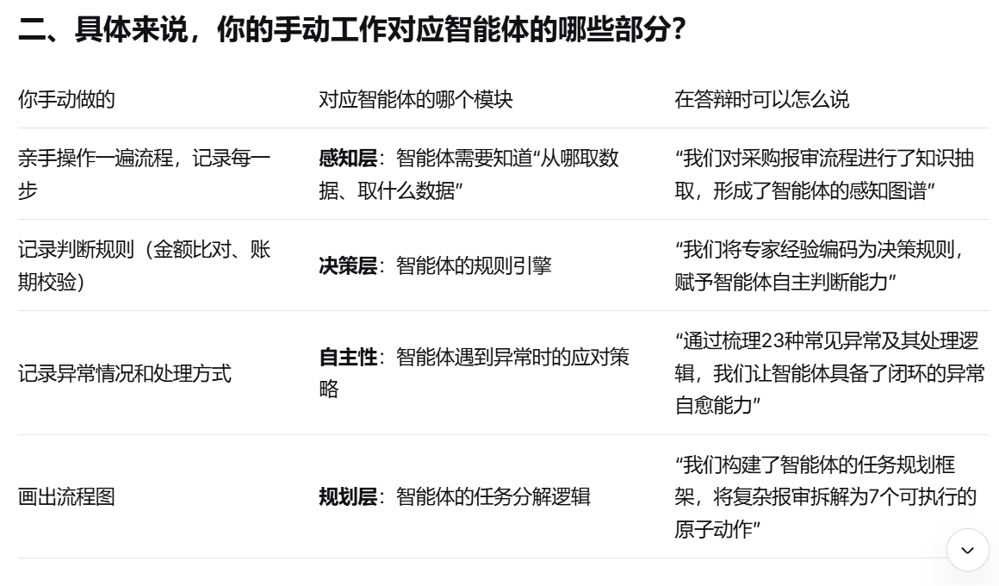

# 0323 Mon

日期: 2026年3月23日
標籤: daily

- 上午
    
    看《AI是怎么回事》
    
    > Transformer 的核心想法可以用一句话概括：**不要一个字一个字地读了。让 AI 同时看到所有的字，然后自己决定哪些字和哪些字相关。**
    > 
    
    > **注意力机制不是改变了词本身的意思，而是让词的意思随上下文而变化。**
    > 
    
    
    

- 下午
    
    找洁莹姐聊工作生活近况。一心六力、三提。
    
    开始采购项目。明天研究一下浏览器定位元素。有浏览器插件可以直接录制转脚本！！
    
    