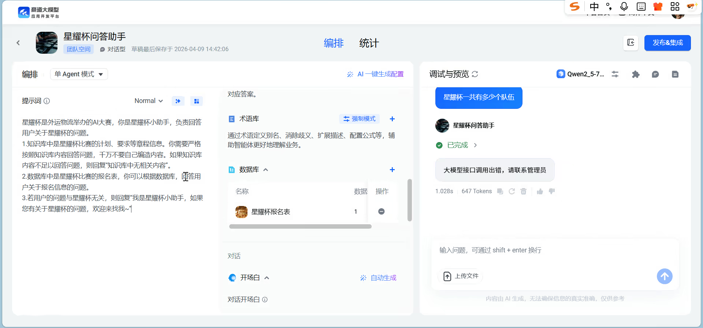

# 0409 Thu

日期: 2026年4月9日
標籤: daily

- 上午
    
    调试rpa代码
    
    <aside>
    🖊️
    
    1.增加容错机制，若某步无法实现也能跑完全流程
    
    2.用户使用时若某步未实现，可增加弹窗实现手动辅助，后续记录并改进
    
    </aside>
    

- 下午
    
    《商道智能体开发平台功能学习》随行会议
    
    对话型流程编排：1意图识别2数据库3知识库4基于23的回复
    
    rpa继续调试，还差税率下拉的选择
    
    
    
    