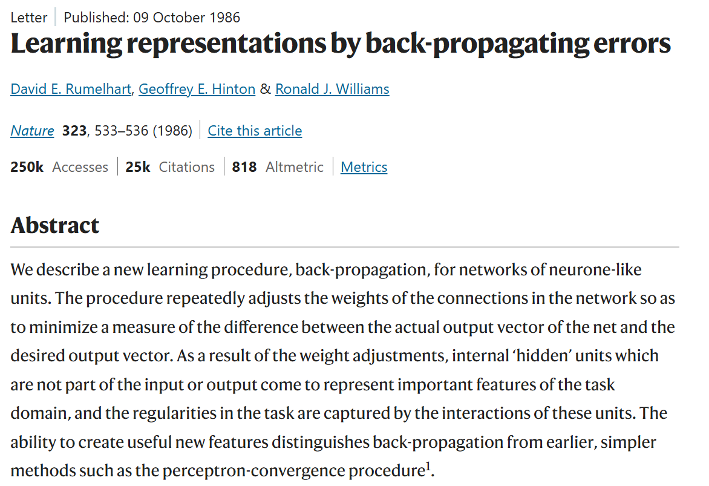

# 0506 Wed

日期: 2026年5月6日
標籤: daily

- 上午
    - ppt提交
    - 重读 ai是怎么回事
        
        > 这就是”学习”的本质：不是有人教了它规则，而是它从大量的对错反馈中，自己找到了有用的规律。
        > 
        
        > **这就是”深度学习”里”深度”的含义——很多层检测器叠加在一起。** 层数越多，能识别的东西就越复杂。
        > 
        
        > 无论 AI 做什么，第一步永远是**把输入变成数字**。图像的”数字化”是像素矩阵，语言的”数字化”就是词向量。
        > 
        
        关于反向传播的论文摘要
        
        
        

- 下午
    - 接到万益特混装拼柜需求
    - 测试调整shell_print新需求
    - 风控rpa同事测试，提新需求