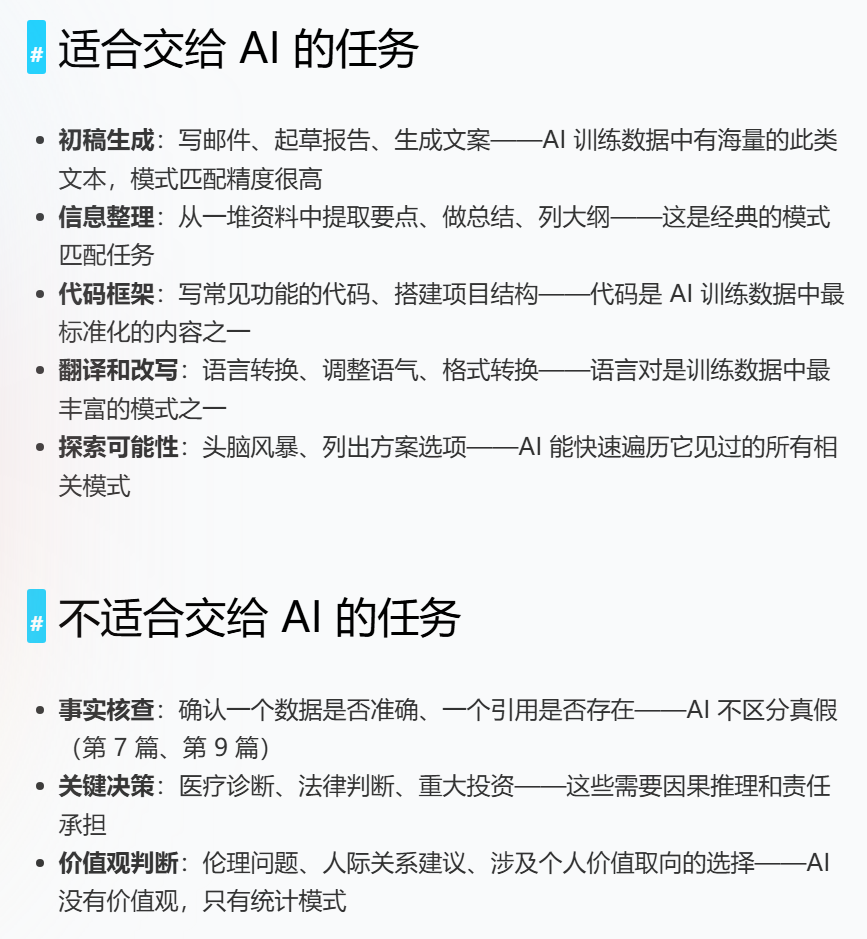

# 0519 Tue

日期: 2026年5月19日
標籤: daily

- [项目]
    - 万益特初步交付试用，需要在可视化里加产品代码。重新调正算法里的权重评分计算逻辑

- [学习]
    - 思维链本质上是在做这件事：把一个复杂的大问题拆成多个简单的小步骤，每一步的输出都成为下一步的上下文。AI 不需要在”一步到位”的巨大可能性空间中猜答案，而是在每一步的小范围内做高精度的匹配。
    - **Prompt Engineering 的边界，就是 AI 能力的边界。** 好的 Prompt 能让 AI 在它擅长的范围内发挥到极致，但不能让它超越模式匹配本身的局限。
    - 

- [7788]
    - 姜文那部电影里的"让子弹飞一会"，本质是**对"还没看清的局面保持耐心"**——不急着开第二枪，不急着下结论，让事情自己显形。