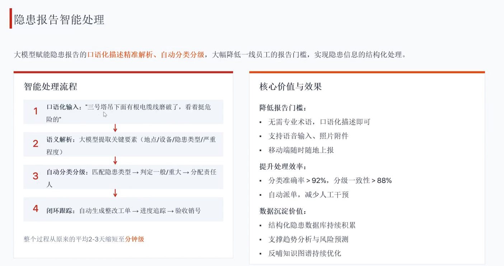

# 0616 Tue

日期: 2026年6月16日
標籤: daily

- [任务]
    - 现有混装规则修改：原来是遍历所有可能，横竖皆可。现在都是打竖优先考虑，如果柜宽方向空隙太大可以考虑打横装一列（40尺柜装5L时）20尺柜由于是最后装，几乎没有单一货品的情况，所以只考虑混装，混装也是打竖优先，每种货品每行怎么装是确定的，再调整每段的行数（保证长度利用最大）。现在需要列出表格，40尺海运、铁路柜，每种单一货品分别能装多少箱。再考虑40尺混装和20尺混装
    - “AI+排查整治风险隐患”主题授课。
        
        
        
        
        
- [学习]
    - 
- [7788]
    - 如果项目有理不清的地方，可以在当天的工作记录页面里写写思路
    - 以后交工作总结或者其他word/ppt，第一版直接ai生成，后面再自己改细节。