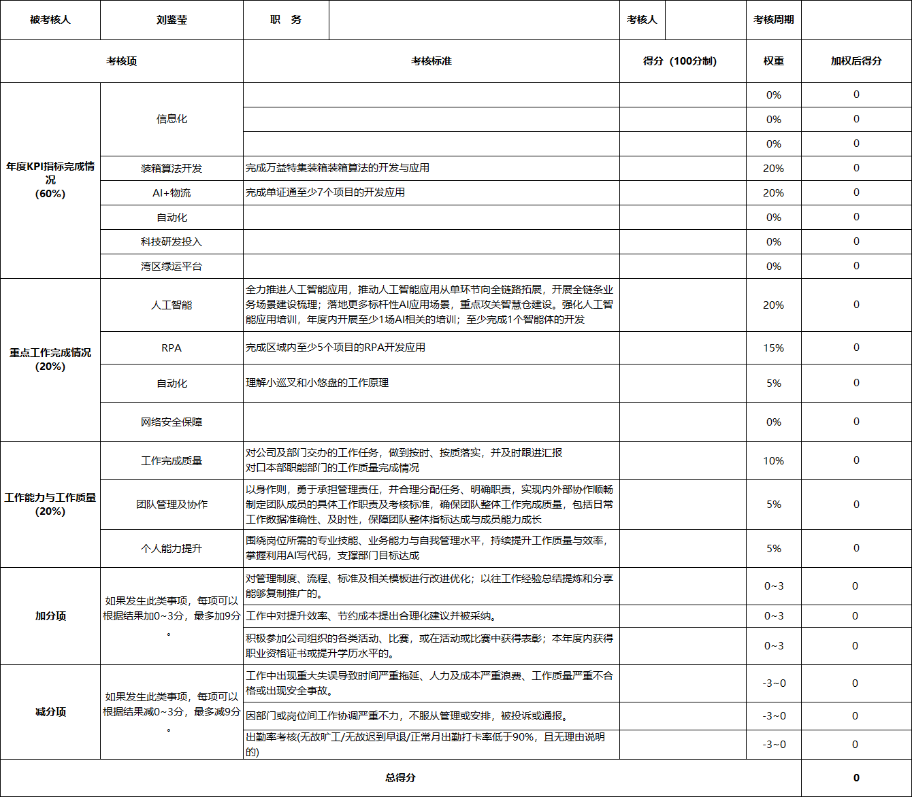

# 0630 Tue

日期: 2026年6月30日
標籤: daily

- [任务]
    - 风控新需求带审批时长打包交付
    - 工作年度考核
    

- [学习]
    - 记anki。后面要加两类卡：①物流/供应链术语英文（warehouse, consolidation, utilization rate, last-mile…）②AI/工程术语（inference, fine-tune, pipeline, eval…）
    - GitHub闲逛
    - 跟ai聊Forward Deployed Engineer（FDE）职业规划。后来又聊出了新的学习方式：跟ai协作完成一个项目后，再用ai写的代码反哺自己的基础知识。
- [7788]
    -