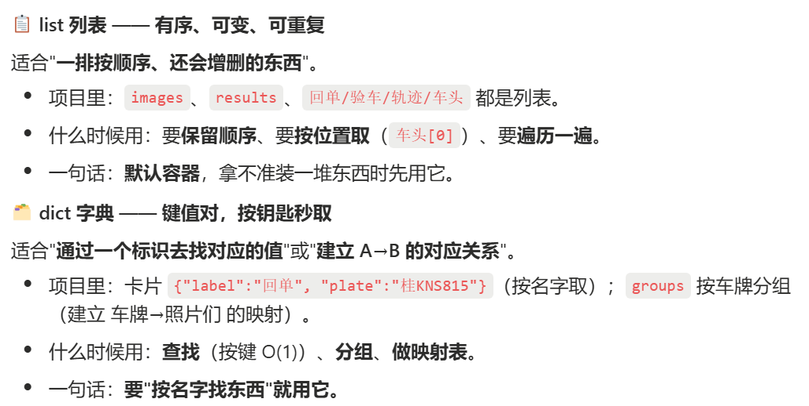
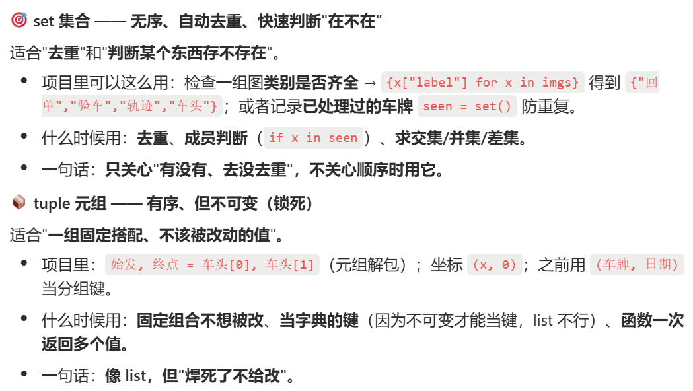

# 0701 Wed

日期: 2026年7月1日
標籤: daily

- [任务]
    - 与万益特客户电话沟通，确认产品参数及下一步项目改进方向

- [学习]
    - 根据中石油项目学习数据结构和建模，重新思考项目结构与数据的构建，而不是只要ai的代码完成需求了，怎么写都行
    - 跟ai聊天摘录：**你能指挥 AI 到多高，天花板就是你能验收到多深。AI 把"生产"变便宜了，于是"判断"变成了稀缺能力。** 谁都能让 AI 吐一堆代码，但能看出哪段靠谱、哪段埋雷的人不多——你的价值就卡在这条线上。**AI 给你的是"一个合理的默认答案"，而你要能判断"这个默认答案配不配得上我真正的需求"，并把它引导到更好的方向。** 这就是意义。
    - 记anki

- [7788]
    -