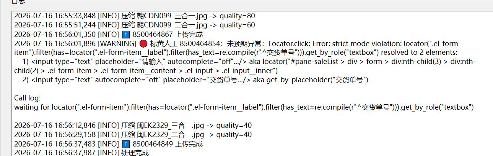

# 0716 Thu

日期: 2026年7月16日
標籤: daily

- [任务]
    - 中石油每单依次上传基本完成，重构ui。新单识别测试，订单图片清晰度有限，打算从表格里提取车牌号对应的交货单号和订单号。仅使用ocr识别结果的打标识来拼图即可。还要考虑一种情况，表格里的订单未必会一次性收齐，所以会存在有数据但是无子文件夹的情况。
    
    
    
- [学习]
    - **决策记录业内叫ADR(Architecture Decision Record)，**放**仓库里、跟代码一起版本管理**
- [7788]
    -