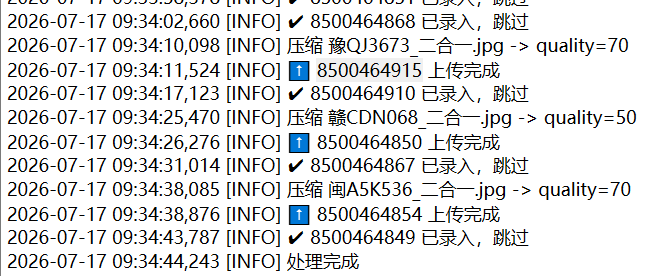
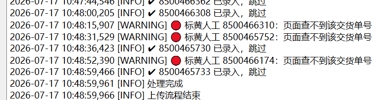
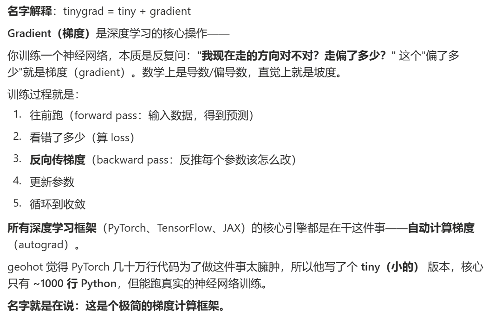
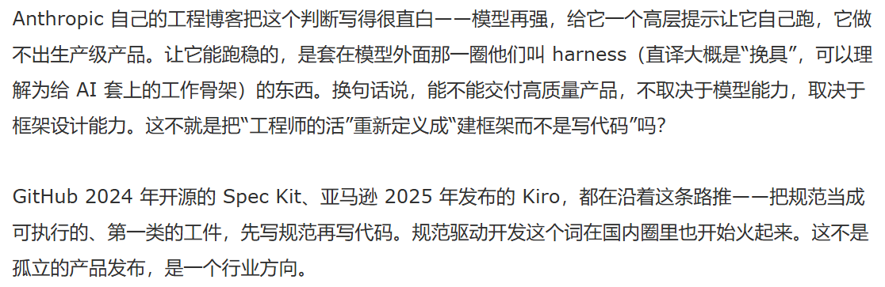

# 0717 Fri

日期: 2026年7月17日
標籤: daily

- [任务]
    - 中石油上传测试，拼图上传第二次第三次出现的日志。打算先暂停测试，下午先推进下万益特，写工作周报

- [学习]
    - 科技周刊
    - geohot。tiny gradient
    - 把过去你认为是“运维或基础设施团队管”的那些事——可观测性Observability、灰度Canary Release、回滚rollback——纳入你日常代码工作的一部分。这是你新的安全网，AI 写得越快越多，这张网就要越密。

- [7788]
    -