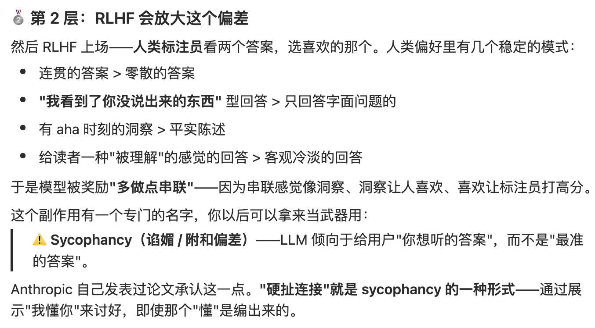

# 0729 Wed

日期: 2026年7月29日
標籤: daily

- [任务]
    - 壳牌修复：车队归类一个单元格有多个sap单号问题（一开始没考虑到

- [学习]
    - 跟ai一起读了一篇Taste is trained judgment ，impressed的话： "AI is very good at adding. Design is required to subtract."
    - 跟llm聊天会有Sycophancy（谄媚 / 附和偏差）

- [7788]
    - 继续玩murdoku