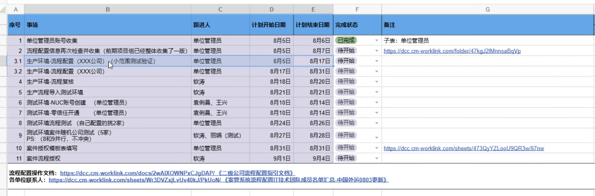

# 0804 Tue

日期: 2026年8月4日
標籤: daily

- [任务]
    - 继续发邮件验收工作😭
    - 集团案件管理系统IT培训。通用模版：高新物流（苏州）
    

- [学习]
    - 沙盒：一个跑在远端的一次性 Linux 容器，llm通过终端 / 读写文件的方式操作它
    - 打算学GitHub issues+docker
- [7788]
    -