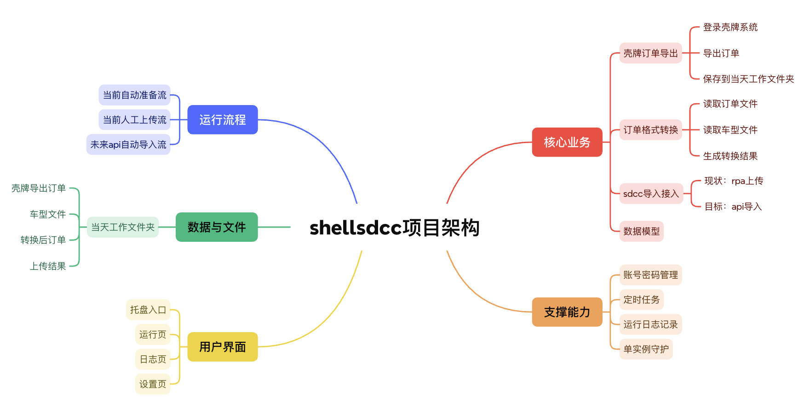

# 0827 Thu

日期: 2026年8月27日
標籤: daily

- [任务]
    - 壳牌梳理完毕，项目重构改造中，实施方向一：清理兼容死代码，统一命名

- [学习]
    - 梳理思维导图完毕
    - 让notion ai连mcp推送GitHub，总共重写8个文件，虽然每个文件只改几处，但整个文件还是要重新写入，有的文件1000+行超token了，所以试了好几次都没推成功，所以就自己手动改其中的大文件，其他7个小文件直接推送就成功了✌️

- [7788]
    - 非专业的朋友试图用codex开发发邮件的自动化，反馈如右。我的一些思考：从0到1ai可以帮忙架构，毕竟不是多复杂的需求，但开发到半成品开始修改或者增加功能，就需要开发者真的会编排架构，懂文件的功能以及如何耦合的，才能真正处理好代码与功能之间的关系，实现目标需求。
    

