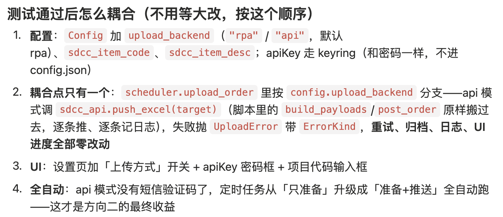
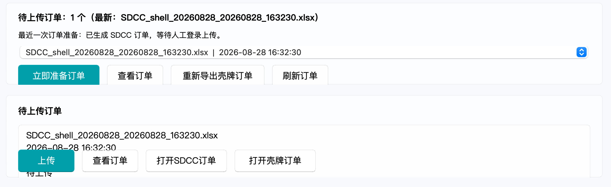
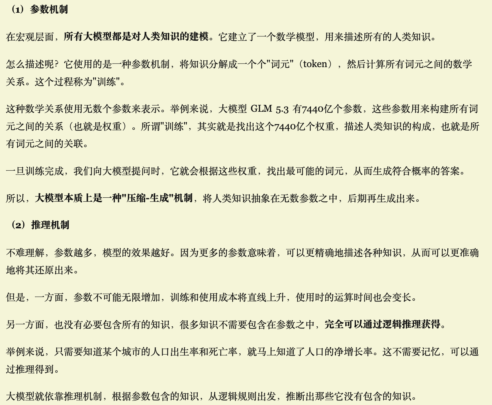
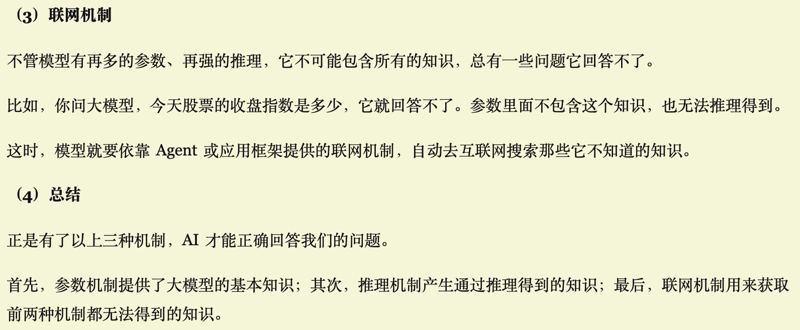

# 0828 Fri

日期: 2026年8月28日
標籤: daily

- [任务]
    - 结束一周的入职培训
    - 壳牌思考api传值怎么跟现在的项目耦合起来，下周拿到apikey开始测试！
    - 「按钮被卡片边界裁切/重叠」不是按钮本身的问题，而是**窗口太矮时 Qt 会把卡片硬压扁**：运行页四张卡片的最低高度加起来（开关卡 + 状态卡 + 待上传卡 + 进度卡 ≈ 700+px）超过了窗口的 640px 最小高度，布局只能把卡片往死里压，按钮就被卡片边界裁掉了。设置页早就遇到过同样的问题，当时的解法是套 QScrollArea——这次我给运行页做了同款处理：**内容超高时可以滚动，不再压缩**。

- [学习]
    - ai三个机制：首先，参数机制提供了大模型的基本知识；其次，推理机制产生通过推理得到的知识；最后，联网机制用来获取前两种机制都无法得到的知识。
    - 工作总结

- [7788]
    -