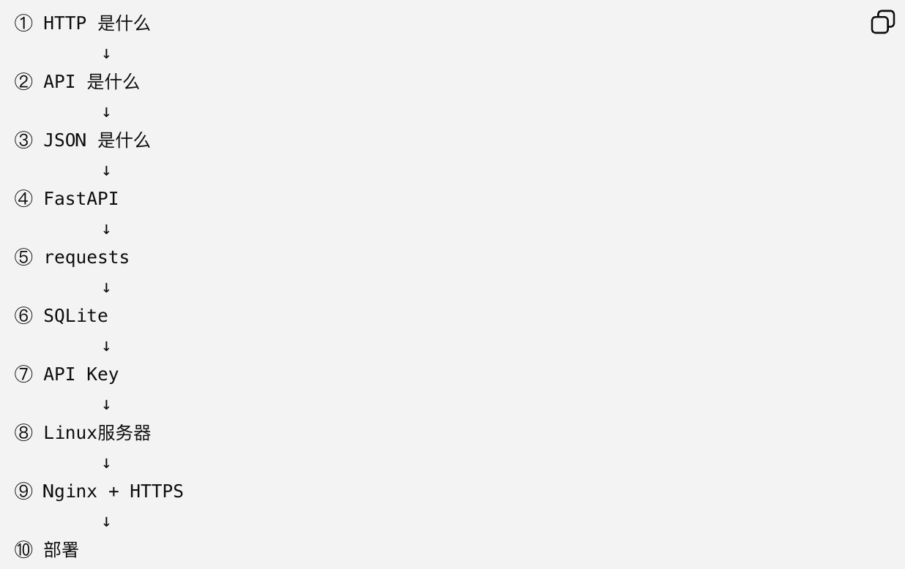
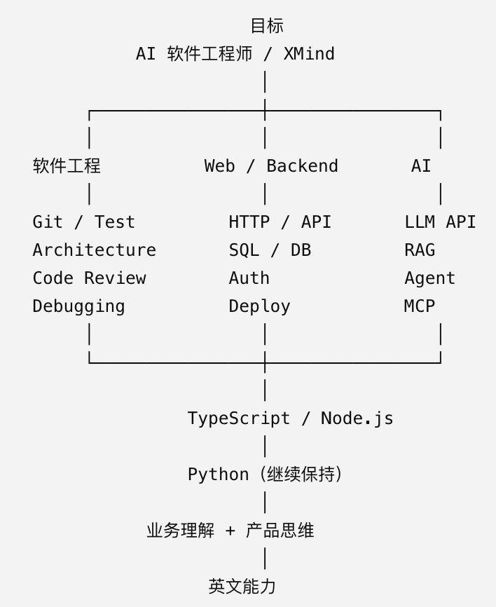

# 0911 Fri

日期: 2026年9月11日
標籤: daily

- [任务]
    - 

- [学习]
    - 以后交付的exe桌面工具可以留后门
    - chatgpt也成功连接了GitHub的mcp✌️
    - 跟gpt聊软件工程里测试的部分，以前自己做的小工具都是能跑得通能用就行，但不怎么专业。学习了单元测试 Unit Test、集成测试 Integration Test、E2E / 端到端测试
    - 正常情况能跑只是最低要求，异常情况才是真正容易藏 Bug 的地方。
    - 工作总结
    

- [7788]
    -