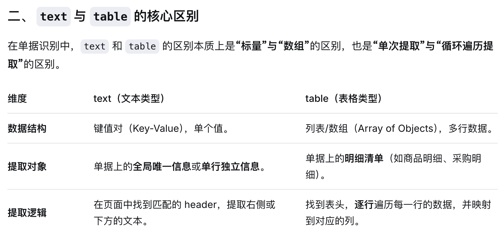

# 0916 Wed

日期: 2026年9月16日
標籤: daily

- [任务]
    - 庄臣回单写单证通的识别提示词，顺便学习提示词格式里涉及的知识，单证通里返回的格式不对，text全改成table就对了✌️😎
    
    
    
- [学习]
    - CI/CD 就是**让代码从“写完”到“上线”的全过程尽可能自动化**，减少人工操作，加快发布速度，同时保证质量。持续集成/持续交付（持续部署）
    - 我目前的情况：会使用 Git 管理项目，但还没有把 GitHub 当成软件交付流水线。
    
    
    
- [7788]
    -