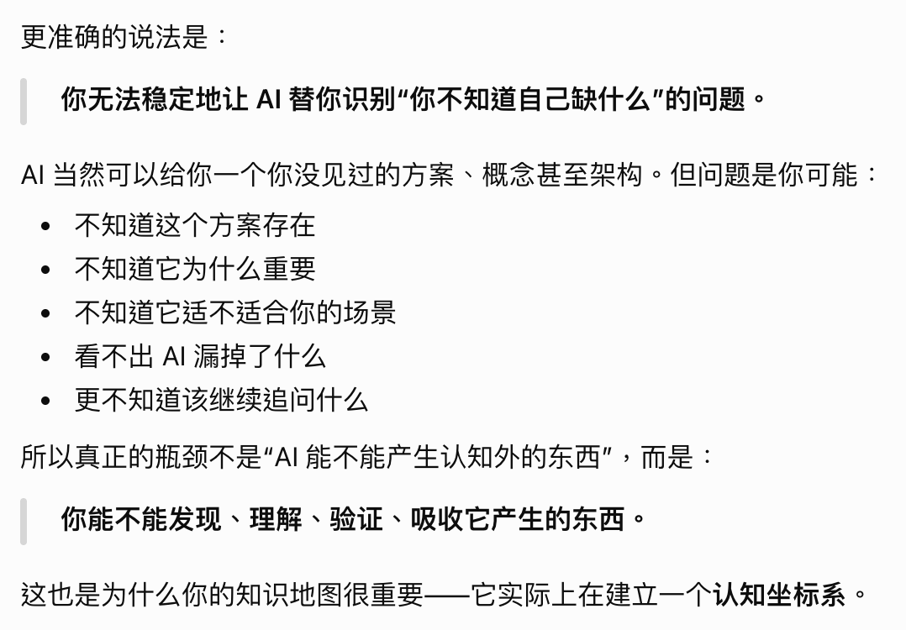

# 0917 Thu

日期: 2026年9月17日
標籤: daily

- [任务]
    - 参观小悠盘
    - 参加中石油找车辆轨迹的会议，做去不同网站找车辆轨迹图片然后截图保存的rpa，这一步要加到中石油现有项目里（考验新功能如何与现有项目耦合

- [学习]
    - 画我的it知识地图（已学习当学习未学习）
    - 一些跟ai协同学习/办公的感想

- [7788]
    -