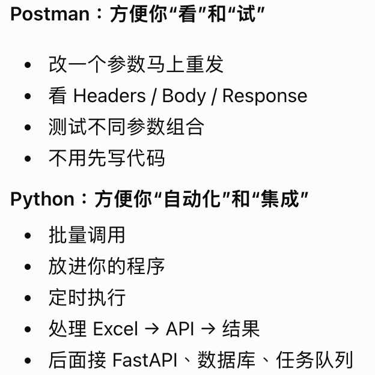

# 0924 Thu

日期: 2026年9月24日
標籤: daily

- [任务]
    - 参加制度系统上线会议，要求9月底上线

- [学习]
    - Postman 本质：不依赖浏览器，手动构造并发送 HTTP 请求。Postman 做的绝大多数“发送 HTTP 请求”的事情，Python 都能做（用requests库）
    - 用deerpark skill学习

- [7788]
    -